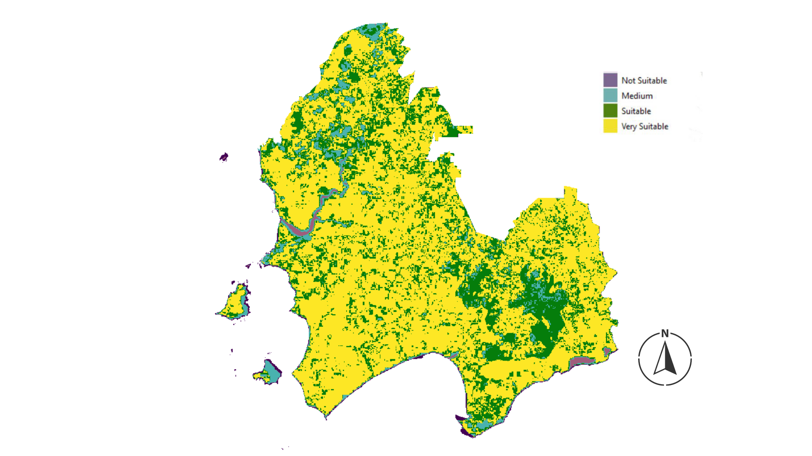

<style>
body {
text-align: justify}
</style>


```{r setup, include=FALSE}
knitr::opts_chunk$set(echo = TRUE)
```


## Motivation 

Oil palm industries have been rising in the last decade in Indonesia. One of Indonesia's top 5 biggest oil palm producers is in West Kalimantan.
To prevent the high rate of expansion, the government of West Kalimantan
released the Governor Regulation in 2021 that set the cap/maximum on
area oil palm plantations expansion area in West Kalimantan. On the other hand, the Indonesia Government has some priorities, such as
achieving B100. This contradictive regulation between the provincial and
national governments will create a chance to expand more land for palm
oil plantations. Hence, the government of West Kalimantan should priority of which area
can be released to be converted into oil palm smallholder plantations that provide benefit for society.
We will focus to describe Kendawangan Municipality, West Kalimantan.




## Metodology

* 1. Defining Area (Destructive and Non Destructive)
        + Shrub Land, Swamp Shrub Land, Dryland Agriculture Mixed Shrub Land define as Tree Cover Loss (Destructive)
        + Open Land defines as Non-Tree Cover Loss (Non Destructive)
* 2. Comparing NPV in both type of area
* 3. Analyzing Tradeoff NPV as a decision


## Input Table

The input data that is passed to the model function is shown in the table below. Note that the table represents only the first lines and is fully available from the git repository. This can be found [here](https://github.com/PhilippAusgust/EU_Subsidies).

```{r, echo=FALSE, message=FALSE, warning=FALSE,error=FALSE}
library(tidyverse)
mod <- read.delim("palm_oil_input_new .csv", sep = ",")
knitr::kable(head(mod), "pipe", caption = "Input Table")
```


## Build Model 

First, the costs are calculated for a palm oil plantation where there is not tree cover loss.
The costs incurred are highlighted in green. 
The income is composed of the price for the palm oil (Fresh Fruit Bunch) and the yield. We use Gompertz Model to predict the total yield during the life cycle period. Finally, we calculated the NPV. 


```{r, echo=FALSE}
library(DiagrammeR)
DiagrammeR("
           
           graph LR

           I(Income)-->N(NPV Non TCL)
           san(costs_no_tree_cover_loss)-->I
           aa(establishment_cost_n_tcl)-->san
           bb(mainte_cost_no_tcl)-->san
           cc(mainte_cost_immatur_no_tcl)-->san
           dd(transport_cost_no_tcl)-->san
           ee(harvest_cost_no_tcl)-->san
           ff(cert_cost_no_tcl)-->san
           uue(no_extra_land_clearing_costs)-->san


           style san fill:springgreen, stroke:#333,stroke-width:2px;
           style aa fill:springgreen, stroke:#333,stroke-width:2px;
           style bb fill:springgreen, stroke:#333,stroke-width:2px;
           style cc fill:springgreen, stroke:#333,stroke-width:2px;
           style dd fill:springgreen, stroke:#333,stroke-width:2px;
           style ee fill:springgreen, stroke:#333,stroke-width:2px;
           style ff fill:springgreen, stroke:#333,stroke-width:2px;
           style uue fill:springgreen, stroke:#333,stroke-width:2px;
           
")

```

After calculating the NPV for palm oil production without tree cover loss, we now calculate the NPV for palm oil production with tree cover loss. 
It should be noted that palm oil production with tree cover loss results in significantly higher establishment costs for the plantation and that environmental damage occurs as well as clearing cost. We calculated the environmental damage cost based on [Sharma, Sunil K., et al. 2019](https://reader.elsevier.com/reader/sd/pii/S2212041619301652?token=FA973FB9689EF2A95F4171C56D9F36C6B0696A1059D672E00440CBB618CCF2C1A9D2BC826A238280EE91C3A8C0454208&originRegion=eu-west-1&originCreation=20220804122033).


```{r, echo=FALSE}
library(DiagrammeR)
DiagrammeR("
           
           graph LR

           I(Income)-->N(NPV TCL)
           saf(costs_tree_cover_loss)-->I
           EV(Environmental_Cost_Tree_Cover)-->CTCL(costs_tree_cover_loss)
           CTCL-->saf
           ectcl(establishment_cost_tcl)-->saf
           mcl(mainte_cost_immature)-->saf
           mclm(mainte_cost_mature)-->saf
           trc(transport_cost)-->saf
           hcl(harvest_cost)-->saf
           ccl(cert_cost)-->saf
           uu(extra_land_clearing_costs)-->ectcl

           style saf fill:orangered, stroke:#333,stroke-width:2px;
           
           style EV fill:orangered, stroke:#333,stroke-width:2px;
           style CTCL fill:orangered, stroke:#333,stroke-width:2px;
           style ectcl fill:orangered, stroke:#333,stroke-width:2px;
           style mcl fill:orangered, stroke:#333,stroke-width:2px;
           style mclm fill:orangered, stroke:#333,stroke-width:2px;
           style trc fill:orangered, stroke:#333,stroke-width:2px;
           style hcl fill:orangered, stroke:#333,stroke-width:2px;
           style ccl fill:orangered, stroke:#333,stroke-width:2px;
           style uu fill:orangered, stroke:#333,stroke-width:2px;
")
```


## Build Model Function

```{r}

library(decisionSupport)

po_decision_function <- function(x, varnames){
  
  # define each variable as vectors of 25 values 
  # corresponding to 25 years of simulation
  
  establishment_cost_n_tcl <- rep(0, n_years)
  estab_cost_tcl <- rep(0, n_years)
  mainte_cost <- rep(0, n_years)
  mainte_cost_im <- rep(0, n_years)
  land_tax_var <- rep(0, n_years)
  harvest_cost <- rep(0, n_years)
  transport_cost <- rep(0, n_years)
  cert_cost <- rep(0, n_years)
  tot_po_yield_non_tcl <- rep(0, n_years)
  total_po_benefit_TCL <- rep(0, n_years)
  FFB_price <- rep(0, n_years)
  po_yield <- rep(0, n_years)
  envrionmental_cost_n_tcl <- rep(0, n_years)
  environment_cost_tcl <- rep(0, n_years)
  total_po_benefit_TCL <- rep(0, n_years)
  tot_po_yield_non_tcl <- rep(0, n_years)

  # pre-calculate common random draws for two scenario model runs
  
  #calculate palm oil system costs with non tree cover loss 
  #(minimum land conversion)
  
  #establishment cost
  establishment_cost_n_tcl[1] <- establishment_cost_non_tcl
  establishment_cost_n_tcl[2:25] <- 0
  
  #tax
  land_tax_var[1] <- 0
  land_tax_var[2:3] <- vv(land_tax, var_land, 2)
  land_tax_var[4:25] <- vv(land_tax, var_land, 22)
  
  #harvesting cost
  harvest_cost[1:3] <- 0
  harvest_cost[4:25] <- vv(harvesting_cost, var_harvest, 22)
  
  #transportation cost -> to bring FFB to market
  transport_cost[1:3] <- 0
  transport_cost[4:25] <- vv(transportation_cost, var_transport, 22)
  
  #maintenance cost (including fertilizers and labour)
  mainte_cost[1:7] <- 0
  mainte_cost[8:25] <- vv(maintenance_cost, var_maintenance, 18)
  
  mainte_cost_im[1] <- 0
  mainte_cost_im[2:7] <- vv(maintenance_cost_im, var_maintenance, 6)
  mainte_cost_im[8:25] <- 0
  
  #RSPO certification cost -> to minimize risk FFBs
  # FFBs risk -> not accepted in market
  cert_cost[1] <- certification_cost
  cert_cost[2:25] <- 0
  
  
  #calculate palm oil system costs with tree cover loss
  # including extra clearing cost and environmental cost
  
  #establishment cost
  estab_cost_tcl[1] <- establishment_cost_tcl
  estab_cost_tcl[2:25] <- 0
  
  #establishment cost
  environment_cost_tcl[1:25] <- vv(environmental_cost_tcl, var_CV, 25)
  
  #FFB price
  FFB_price[1] <- 0
  FFB_price[2:7] <- vv(FFB_price_immature, var_FFB, 6) 
  FFB_price[8:25] <- vv(FFB_price_mature, var_FFB, 18)
  
  # benefits of palm oil
   po_yield <- gompertz_yield(max_harvest = max_palm_harvest, 
                            time_to_first_yield_estimate = immature_palm_est, 
                            time_to_second_yield_estimate = mature_palm_est,
                            first_yield_estimate_percent = immature_palm_yield_est,
                            second_yield_estimate_percent = mature_palm_yield_est,
                            n_years = n_years, 
                            var_CV = 0, 
                            no_yield_before_first_estimate = TRUE)
  
  tot_po_yield_non_tcl <- po_yield
  tot_po_benefit_non_tcl <- tot_po_yield_non_tcl * FFB_price
  
  #
  tot_po_yield_tcl <- po_yield
  tot_po_benefit_tcl <- tot_po_yield_tcl * FFB_price
  
  # calculate NPVs palm oil plantation non tree cover area 
  # and tree cover loss
  total_po_benefit_non_TCL <- tot_po_benefit_non_tcl - establishment_cost_n_tcl - mainte_cost - mainte_cost_im- transport_cost - harvest_cost - cert_cost
  
  total_po_benefit_TCL <- tot_po_benefit_tcl -  estab_cost_tcl - mainte_cost - mainte_cost_im - transport_cost - harvest_cost - cert_cost - environment_cost_tcl
  
  
  #NPV of palm oil plantation non tree cover loss
  NPV_non_TCL <- discount(total_po_benefit_non_TCL, discount_rate = discount_rate, 
                          calculate_NPV = TRUE ) 
  
  #NPV of palm oil plantation tree cover loss
  NPV_TCL <- discount(total_po_benefit_TCL, 
                     discount_rate = discount_rate, 
                     calculate_NPV = TRUE)
  
  #benefit of choosing palm oil plantation non tree cover loss over palm oil plantation tree cover loss
  tradeoff_benefit <- NPV_non_TCL - NPV_TCL
  
  
  #final NPV of the decision to choose non tree cover loss or tree cover loss
  NPV_tradeoff <- discount(tradeoff_benefit, 
                           discount_rate = discount_rate, 
                           calculate_NPV = TRUE )
  
    #in the return list, one could indicate any outcome that they wish to see from the model
  return(list(trade_off = NPV_tradeoff, 
              Non_TCL_NPV = NPV_non_TCL, 
              TCL_NPV = NPV_TCL,
              Cashflow_n_TCL = total_po_benefit_non_TCL,
              Cashflow_TCL = total_po_benefit_TCL))
}

```


## Monte Carlo Simulation

After the model function has been created, it is continued to the function "mCSimulation" from the decision Support Package. The simulation is run a total of 1000 times.

```{r}
mcSimulation_results <- decisionSupport::mcSimulation(
  estimate = decisionSupport::estimate_read_csv("palm_oil_input_new .csv"),
  model_function = po_decision_function,
  numberOfModelRuns = 1000,
  functionSyntax = "plainNames")

```


## Cashflow

First we have a look at the casflow with no tree cover loss. Figure 2 is showed that a positive
cashflow is generated after year 7. Figure 3 is described the expected cash flow with tree cover loss. 
It is clearly to recognize that a positive cash flow can be obtained after year 10. Oil palm plantation with tree cover loss generated positive value more longer and lower than oil palm plantation without tree cover loss.

```{r, echo=FALSE, fig.align='left', fig.cap="**Fig. 2** Cashflow Non Tree Cover Loss", }
  
plot_cashflow(mcSimulation_object = mcSimulation_results, 
              cashflow_var_name = "Cashflow_n_TCL")
```


```{r, echo=FALSE, fig.align='left', fig.cap="**Fig. 3**  Cashflow Tree Cover Loss ", }

plot_cashflow(mcSimulation_object = mcSimulation_results, 
              cashflow_var_name = "Cashflow_TCL")


```

## Comparisson

```{r, echo=FALSE, fig.align='left', fig.cap="**Fig. 4**  Comparisson NPV Tree Cover Loss and NPV No Tree Cover Loss ", }


decisionSupport::plot_distributions(mcSimulation_object = mcSimulation_results, 
                                    vars = c("Non_TCL_NPV", "TCL_NPV"),
                                    method = 'smooth_simple_overlay', 
                                    base_size = 10)

```


## Trade Off
Figure 5 shows the expected trade off for the during 25 years per hectare if the decision is made for no tree cover loss. On average, a profit of about €15,000 per hectare can be expected. 


```{r, echo=FALSE, fig.align='left', fig.cap="**Fig. 5**  Trade Off Decision No Tree Cover Loss ", }
decisionSupport::plot_distributions(mcSimulation_object = mcSimulation_results, 
                                    vars = "trade_off",
                                    method = 'boxplot_density')

``` 


## Variable Importance in Projection (VIP)

The VIP indicates whether the variables from the Input Table are positively or negatively correlated with the tree cover loss decision. In this case, as the "Environmental Cost Tree Cover (EUR/ha)" increases, the option to accept a tree cover loss is discarded. 
Looking at the yield, a positive correlation can be observed. This means that with increasing yield, a tree cover loss is accepted more easily and rationally. 


```{r, echo=FALSE, fig.align='left', fig.cap="**Fig. 6**  VIP ",}
pls_result <- plsr.mcSimulation(object = mcSimulation_results,
                                 resultName = names(mcSimulation_results$y)[3], ncomp = 1)
S<-plot_pls(pls_result, input_table = mod, threshold = 0)
S
```


##  Expected Value of Perfect Information (EVPI)


Basically, it should be considered which benefit can be drawn from the Monte Carlo simulation. The EVPI can be used for this purpose.  The EVPI evaluates the value that the information has, which gives information about the decision to be made. 

### Calculation EVPI

```{r}
# preparation EVPI
mcSimulation_table <- data.frame(mcSimulation_results$x, mcSimulation_results$y[1:3])

# calculation EVPI
evpi <- multi_EVPI(mc = mcSimulation_table, first_out_var = "trade_off")

# plot EVPI
plot_evpi(evpi, decision_vars = "trade_off")

```

In this case, three variables are calculated.  If these are plotted, a warning message appears indicating that no variable with a positive EVPI exists. 
This result can be interpreted as follows. Generally, a decision for or against Tree Cover Loss can be made. The simulation shows that it is always advantageous to decide against a Tree Cover Loss. The case that under certain conditions a decision for Tree Cover loss is made does not exist. Therefore, it is not necessary to investigate in which cases and which variables have a particular impact to the Tree Cover Loss decision. 
For this reason, the EVPI is not positive. It means that the option "no tree cover loss" should always be chosen. 


## Conclusion


The government should prioritize to release the non tree cover area (open land) to the smallholder of oil palm plantation in the very suitable land because the benefit are higher than converting area with tree cover loss (Shrub land etc).
On the other hand, if the government decide to convert the area with tree cover to the smallholder, they will obtain negative result.

## References

Luedeling, Eike, Lutz Goehring, and Katja Schiffers. 2019. *DecisionSupport: Quantitative Support of Decision Making Under Uncertainty*
<br>
<br>
Hutabarat, S., Slingerland, M., Rietberg, P., & Dries, L. (2018). *Costs and benefits of certification of independent oil palm smallholders in Indonesia.* International Food and Agribusiness Management Review, 21(1030-2018-3328), 681-700
<br>
<br>
Levin, J., Ng, G., Fortes, D., Garcia, S., Lacey, S., & Grubba, D. (2012). *Profitability and sustainability in palm oil production. Analysis of Incremental Financial Costs and Benefits of RSPO Compliance*. WWF-US, FMO, CDC
<br>
<br>
Hutabarat, S., Slingerland, M., Rietberg, P., & Dries, L. (2018). *Costs and benefits of certification of independent oil palm smallholders in Indonesia.* International Food and Agribusiness Management Review, 21(1030-2018-3328), 681-700
<br>
<br>
Sharma, S. K., Baral, H., Laumonier, Y., Okarda, B., Komarudin, H., Purnomo, H., & Pacheco, P. (2019). *Ecosystem services under future oil palm expansion scenarios in West Kalimantan, Indonesia.* Ecosystem services, 39, 100978
<br>
<br>
Hoa, T. D., Whitney, C. W., & Luedeling, E. (2018). *Agroforestry Options in Northwest Vietnam. Tropentag, September 17-19, 2018. Ghent, Belgium" Global food security and food safety: The role of universities".* Book of Abstracts., 210.


