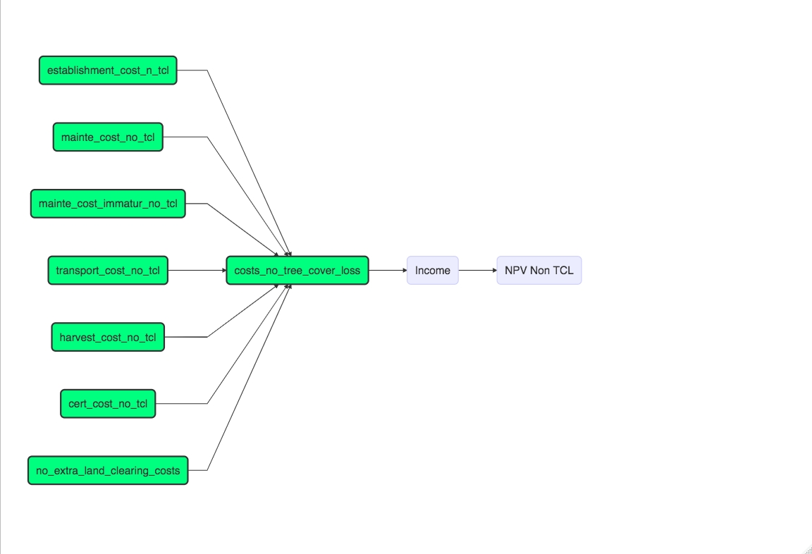
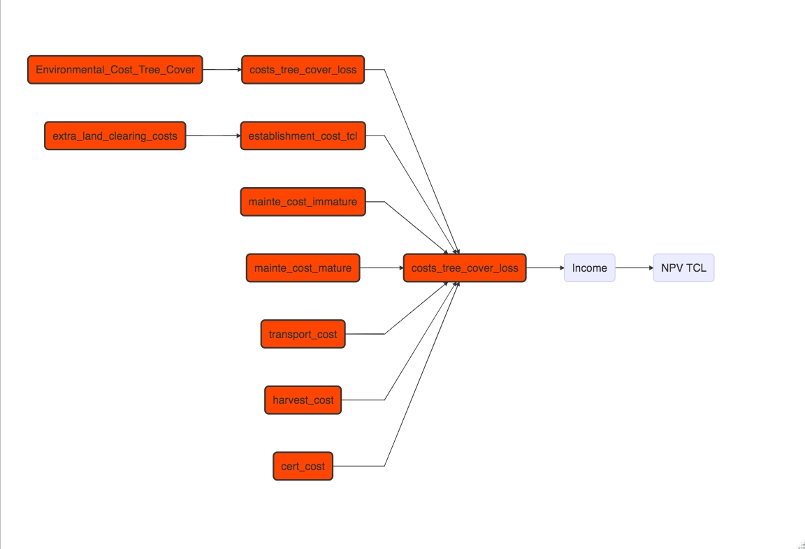

# Palm_Oil_Plantation!

## Motivation

Oil palm industries have been rising in the last decade in Indonesia.
One of Indonesia’s top 5 biggest oil palm producers is in West Kalimantan. To prevent the high rate of expansion, the government of West Kalimantan released the Governor Regulation in 2021 that set the cap/maximum on area oil palm plantations expansion area in West Kalimantan. On the other hand, the Indonesia Government has some priorities, such as achieving B100. This contradictive regulation between the provincial and national governments will create a chance to expand more land for palm oil plantations. Hence, the government of West Kalimantan should priority of which area can be released to be converted into oil palm smallholder plantations that provide benefit for society. We will focus to describe Kendawangan Municipality, West Kalimantan.

## Modeling

First, the costs are calculated for a palm oil plantation where there is not tree cover loss. The costs incurred are highlighted in green. The income is composed of the price for the palm oil (Fresh Fruit Bunch) and the yield. We use Gompertz Model to predict the total yield during the life cycle period. Finally, we calculated the NPV.

After calculating the NPV for palm oil production without tree cover loss, we now calculate the NPV for palm oil production with tree cover loss. It should be noted that palm oil production with tree cover loss results in significantly higher establishment costs for the plantation and that environmental damage occurs as well as clearing cost. We calculated the environmental damage cost based on Sharma, Sunil K., et al. 2019.

